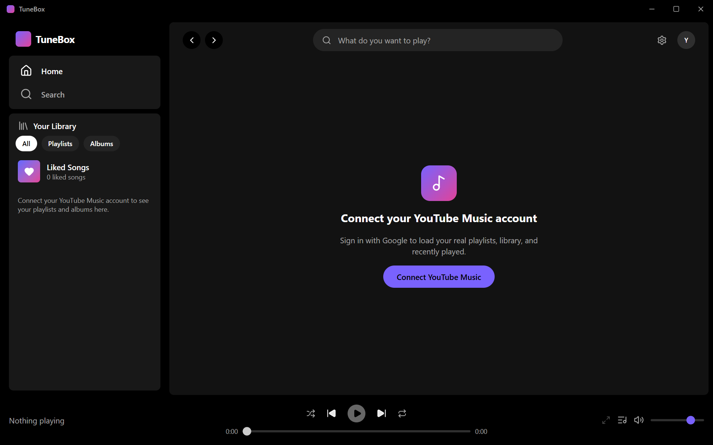
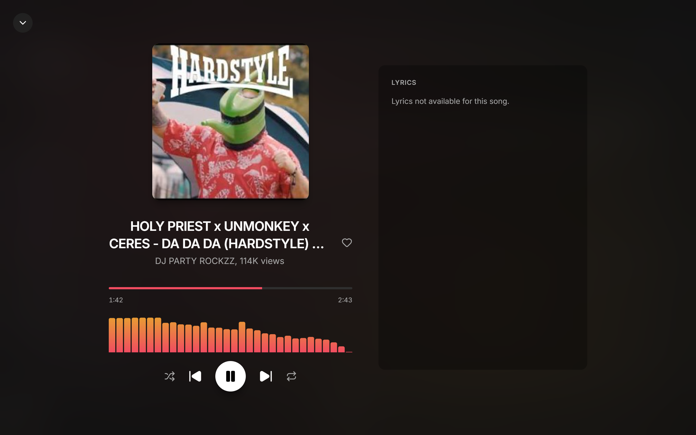
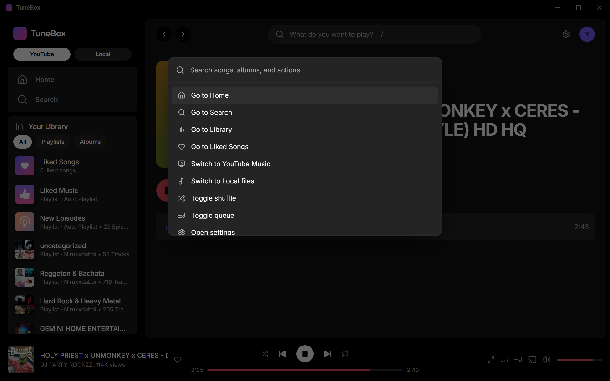
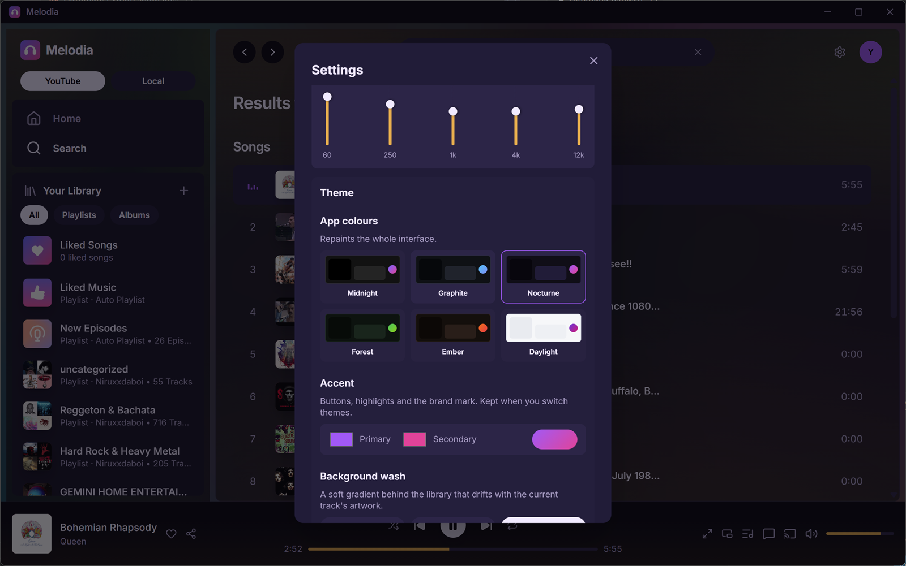

<div align="center">


# Melodia

**A desktop music player for your YouTube Music library — and your local files.**

Real playback, your real playlists, and a UI you can make your own.

<p>


</p>

<p>


</p>



</div>

---

## What is Melodia?

Melodia signs in to your Google account and plays your **actual** YouTube Music
library — your playlists, albums, history, and search. Audio is decoded natively
in Rust rather than piped through a hidden browser tab, which is what makes the
equalizer, the spectrum visualizer, and per-device audio output possible.

It also plays music straight off your disk, so it works with no account at all.

> [!NOTE]
> Melodia is an independent project and is not affiliated with, endorsed by, or
> connected to Google or YouTube.

---

## A look around

<table>
<tr>
<td width="50%"></td>
<td width="50%"></td>
</tr>
<tr>
<td align="center"><b>Fullscreen player</b><br/><sub>Live spectrum visualizer, tinted by the album art</sub></td>
<td align="center"><b>Command palette</b><br/><sub>Jump anywhere with <kbd>Ctrl</kbd>+<kbd>K</kbd></sub></td>
</tr>
</table>



<div align="center"><sub><b>Settings</b> — audio output, quality, equalizer, themes, and more</sub></div>

<!-- More captures. Uncomment a row once the file exists — docs/CAPTURE.md has
     the shot list, sizes, and how to record the GIF.

<p align="center"></p>
<p align="center"><sub>Browsing, playing, and re-theming on the fly</sub></p>

<table>
<tr>
<td width="50%"></td>
<td width="50%"></td>
</tr>
<tr>
<td align="center"><b>Themes</b><br/><sub>Six palettes, custom accents, visualizer colours</sub></td>
<td align="center"><b>Comments</b><br/><sub>Read a song's YouTube comments without leaving</sub></td>
</tr>
</table>
-->

---

## Features

<table>
<tr><td width="33%" valign="top">

### 🎵 Playing music

- Your real playlists, albums, history and search
- Local folder playback with tag reading
- Gapless-feeling fades on play, pause and stop
- Queue with drag-to-reorder
- Sleep timer
- Background playback from the system tray

</td><td width="33%" valign="top">

### 🎛️ Sound

- 5-band equalizer with 8 presets
- Pick your output device
- Streaming quality: Best / Balanced / Data saver
- Lossless local playback — FLAC, ALAC, WAV, AIFF
- OS media keys

</td><td width="33%" valign="top">

### 🎨 Making it yours

- Six app themes, plus a custom accent
- Ambient background that drifts with the artwork
- Optional album-art wallpaper, reshuffled every minute
- Themeable spectrum visualizer
- Mini player that stays on top
- Guided first-run setup

</td></tr>
<tr><td valign="top">

### 📚 Your library

- Create, rename and delete playlists
- Add, remove and reorder songs
- Liked Songs, always pinned
- Lyrics in the fullscreen player
- Copy a share link for any song or playlist

</td><td valign="top">

### ⚡ Getting around

- Command palette (<kbd>Ctrl</kbd>+<kbd>K</kbd>)
- Full keyboard control, <kbd>?</kbd> for the list
- Right-click menus everywhere
- Read a track's YouTube comments in-app

</td><td valign="top">

### 🔗 Connected

- Discord Rich Presence
- Play on another device on your network
- One-click Google sign-in — no API keys

</td></tr>
</table>

---

## Getting started

You'll need **[Node.js](https://nodejs.org/) 18+**, **[Rust](https://www.rust-lang.org/tools/install)**,
and **[Python 3](https://www.python.org/)**. Platform build tools are listed
[below](#platform-requirements).

```bash
git clone https://github.com/niruxx/Melodia.git
cd Melodia

npm install                              # frontend dependencies
pip install -r sidecar/requirements.txt  # YouTube Music helper

npm run tauri dev                        # run it
```

To produce installers instead:

```bash
npm run tauri build
```

Artifacts land in `src-tauri/target/release/bundle/`:

| Platform | You get |
|---|---|
| Windows | `.msi` only — see [Releases and updates](#releases-and-updates) |
| macOS | `.dmg` and `.app` |
| Linux | `.deb`, `.rpm` and `.AppImage` |

Tauri builds only for the machine it runs on — there's no cross-compiling, so
each platform must be built on that platform.

> [!IMPORTANT]
> **Python is needed to run Melodia, not just to build it.** The installer
> bundles the helper script, but the machine still needs Python 3.9+ plus the
> packages in `sidecar/requirements.txt`. The first-run setup guide checks for
> both and installs the packages itself, so an end user doesn't have to touch a
> terminal — see below.

<details>
<summary><b>How the setup guide provisions Python</b></summary>

<br>

The **Set up the music service** step of the first-run guide probes every
interpreter Melodia would use, and asks each one to import the helper's packages
rather than just checking that it launches. It reports the two halves
separately, each with its own fix:

| Check | If it fails |
| --- | --- |
| **Python** | **Get Python** — opens the [Python Install Manager](https://apps.microsoft.com/detail/9NQ7512CXL7T) in the Microsoft Store on Windows (per-user, no administrator), or python.org elsewhere |
| **Helper packages** | **Install** — runs `pip install -r sidecar/requirements.txt` against the detected interpreter, streaming pip's output into the step |

The pip run is always available, including when the check is happy — it becomes
**Run pip again**, so a machine that is broken in a way the check can't see can
still be repaired from the UI. A system-wide interpreter that refuses to be
written to is retried per-user (`--user`) rather than asking for elevation. Once
an install succeeds the sidecar picks it up on its next call, so nothing needs
restarting.

`sidecar/requirements.txt` ships inside the installer (it's a Tauri resource,
alongside `main.py`) *and* is compiled into the binary, so pip has something to
work from even if the installed copy goes missing.

The step is skippable — Melodia still plays local files without it — and it
reopens on the next launch for as long as the helper can't run. It's also
reachable any time from **Settings → Check the music service helper**.

</details>

<details>
<summary><b>If a machine reports Python helper trouble</b></summary>

<br>

The helper is supervised: it's started on demand, restarted automatically if it
ever stops, and the interrupted request is retried, so a one-off death is
invisible. Anything it can't recover from leaves a trace in **`sidecar.log`**,
in Melodia's app data folder (`%APPDATA%\com.melodia.app` on Windows).

Melodia tries `python`, `python3` and `py` in turn, then the per-user locations
the Windows installers use, and checks that each one *answers* rather than
merely launching — so the Microsoft Store `python.exe` placeholder, and
interpreters that are missing the packages, are skipped in favour of one that
works. If none does, the error names each interpreter and why it was rejected.
Installing Python fixes it without restarting the app.

</details>

---

## Releases and updates

Melodia checks **GitHub Releases once per launch** and, if a newer version is
published, shows a one-line banner under the top bar. Clicking it opens that
release's notes with a **Download** button; the × puts it away until the next
launch, and **Skip this version** silences that release for good.

Nothing is downloaded or installed automatically — the check is a single request
to `api.github.com`, and **Settings → Check for updates automatically** turns
even that off. Settings also has **Check now** and the notes for whatever version
you're on.

**Windows ships as an MSI only.** The MSI is configured for in-place upgrades: a
pinned `upgradeCode` in [`tauri.conf.json`](src-tauri/tauri.conf.json) plus the
bundler's `<MajorUpgrade>` rule mean running a newer installer replaces the
existing install — no uninstall step, and settings are kept. That only holds if
the upgrade code never changes, which is exactly why it's pinned rather than
left to be derived from the product name. Verify it any time with:

```bash
npm run tauri inspect wix-upgrade-code
```

> [!NOTE]
> Anyone still on the old NSIS `.exe` build has to uninstall it by hand once —
> the two installer families don't know about each other, and side by side they
> leave two entries in Add/Remove Programs.

**Cutting a release**

1. Bump the version in `package.json`, `src-tauri/Cargo.toml`,
   `src-tauri/tauri.conf.json` and [`src/lib/version.ts`](src/lib/version.ts) —
   all four, or the update banner compares against the wrong number.
2. `npm run tauri build`.
3. Publish a GitHub release whose **tag is a plain `MAJOR.MINOR.PATCH`** (a `v`
   prefix is fine, anything else isn't a version and is ignored by the check),
   with the `.msi` attached. The release body becomes the notes shown in-app.

**After an upgrade**, the first launch re-runs `pip install -r requirements.txt`
against the detected interpreter and shows it in the setup step. An import check
alone can't tell whether a bumped requirement is satisfied — only pip can, and
it does nothing when everything already matches.

---

## Platform requirements

<details>
<summary><b>Windows</b></summary>

<br>

Install [Microsoft C++ Build Tools](https://visualstudio.microsoft.com/visual-cpp-build-tools/)
with the **Desktop development with C++** workload — Rust needs it to link.

WebView2 ships with Windows 10 and 11. On older builds, install the
[Evergreen runtime](https://developer.microsoft.com/microsoft-edge/webview2/).

</details>

<details>
<summary><b>macOS</b></summary>

<br>

```bash
xcode-select --install   # Apple's command line tools
brew install python      # if you don't already have python3
```

Everything else comes with the system — WKWebView for the UI, CoreAudio for
playback.

</details>

<details>
<summary><b>Linux</b></summary>

<br>

**Debian / Ubuntu**

```bash
sudo apt update
sudo apt install -y build-essential curl wget file \
  libwebkit2gtk-4.1-dev librsvg2-dev libssl-dev \
  libayatana-appindicator3-dev libxdo-dev \
  libasound2-dev python3 python3-pip
```

**Fedora**

```bash
sudo dnf install -y @development-tools webkit2gtk4.1-devel librsvg2-devel \
  openssl-devel libappindicator-gtk3-devel libxdo-devel \
  alsa-lib-devel python3 python3-pip
```

**Arch**

```bash
sudo pacman -S --needed base-devel webkit2gtk-4.1 librsvg openssl \
  libayatana-appindicator xdotool alsa-lib python python-pip
```

What the less obvious ones are for:

| Package | Needed for |
|---|---|
| `libwebkit2gtk-4.1` | the webview the UI renders in |
| `libasound2` / `alsa-lib` | audio output — rodio/cpal build against ALSA |
| `libayatana-appindicator3` | the tray icon used by background playback |
| `libxdo` / `xdotool` | tray and global shortcuts on X11 |
| `libssl` / `openssl` | HTTPS |

</details>

---

## Signing in

1. Click **Connect YouTube Music**
2. Click **Sign in with Google** — Google's real sign-in page opens in a window
3. Log in as normal

That's it. No Google Cloud project, no client ID, no API keys. Melodia captures
the resulting session cookie, verifies it against your account before saving
anything, and loads your library.

> [!TIP]
> Cookie sessions last weeks, not forever, and a password change ends them.
> Melodia re-checks at startup and prompts you if yours has lapsed.

<details>
<summary><b>Age-restricted songs: <b>Settings → Play age-restricted songs</b></b></summary>

<br>

Signing in authenticates **ytmusicapi** — your library, search and playlists.
Resolving the actual audio is yt-dlp, a separate client that gets no
credentials, so it reaches YouTube as an anonymous visitor. An anonymous
visitor can't see age-restricted videos whatever your account's age, which is
why one song in a working library fails with *"Sign in to confirm your age"*.

The setting lends yt-dlp the same session, which fixes those songs — plus their
video and comments, which had the same blind spot.

> [!WARNING]
> It is **off by default and worth leaving off unless you need it**. YouTube
> treats account cookies used outside a browser as a bot signal. The realistic
> costs are throttling, *"confirm you're not a bot"* on ordinary tracks, and
> YouTube invalidating the session — which signs you out of your library too,
> since it's the same cookie. Melodia watches for those three specific failures
> and offers to switch the setting back off when it sees one.

While it's on, the session is also written to `ytdlp_cookies.txt` in the app
data folder, in the Netscape format yt-dlp reads (`0600` where the OS honours
it). It's derived, never authoritative: rewritten from the saved session on
demand, and deleted when the setting is turned off or you sign out.

</details>

<details>
<summary><b>Fallback: use your own Google OAuth client</b></summary>

<br>

If the Google window doesn't work for you, choose **"Having trouble? Use the
OAuth client method instead"** in the sign-in dialog:

1. In the [Google Cloud Console](https://console.cloud.google.com/), create a project
2. Configure **APIs & Services → OAuth consent screen** (External + Testing is fine)
3. Under **Credentials**, create an **OAuth client ID**
4. Choose application type **TVs and Limited Input devices**
5. Paste the Client ID and Secret into Melodia, then **Get a code**

OAuth sessions refresh silently, so this needs re-authenticating less often.

</details>

---

## Everyday use

<details>
<summary><b>Playing local files</b></summary>

<br>

1. Open **Settings** → **Local music folder** → **Choose folder…**
2. Melodia scans it for `.mp3`, `.m4a`, `.aac`, `.flac`, `.wav` and `.ogg`,
   reading title, artist, album and cover art from each file's tags
3. Switch to the **Local** tab in the sidebar

Lossless formats play bit-for-bit — no re-encoding.

</details>

<details>
<summary><b>Keeping music playing when you close the window</b></summary>

<br>

Turn on **Keep playing in the background** in Settings. Closing the window then
hides it to the tray instead of quitting.

- **Left-click** the tray icon to bring the window back
- **Right-click** for Previous / Play-Pause / Next, and **Quit**

Quitting from the tray is how you actually exit while this is on.

</details>

<details>
<summary><b>Discord Rich Presence</b></summary>

<br>

Open Settings and click **Enable**, with Discord desktop running. Your presence
updates as tracks change.

This isn't a bot — nothing is added to any server. Discord's protocol just needs
an Application ID in its handshake, which Melodia supplies from
`src/lib/discordConfig.ts`.

**Maintainers:** that file ships with a placeholder. Create an application in the
[Discord Developer Portal](https://discord.com/developers/applications) and paste
its Application ID in to make presence work in your build.

</details>

<details>
<summary><b>Keyboard shortcuts</b></summary>

<br>

Press <kbd>?</kbd> in the app for the full list.

| Key | Action |
|---|---|
| <kbd>Space</kbd> | Play / pause |
| <kbd>←</kbd> <kbd>→</kbd> | Seek 5 seconds |
| <kbd>Shift</kbd> + <kbd>←</kbd> / <kbd>→</kbd> | Previous / next track |
| <kbd>↑</kbd> <kbd>↓</kbd> | Volume |
| <kbd>M</kbd> / <kbd>L</kbd> | Mute / like |
| <kbd>S</kbd> / <kbd>R</kbd> | Shuffle / repeat |
| <kbd>F</kbd> / <kbd>Q</kbd> | Fullscreen player / queue |
| <kbd>/</kbd> | Focus search |
| <kbd>Ctrl</kbd>+<kbd>K</kbd> | Command palette |
| <kbd>Esc</kbd> | Close the topmost overlay |

Your keyboard's media keys work too.

</details>

---

## Platform support

| OS | Minimum | Status |
|---|---|---|
| **Windows** | 10 (1803+) / 11, x64 | ✅ Developed and tested here |
| **macOS** | 11 Big Sur+, Intel & Apple Silicon | ⚠️ Should work, but builds haven't been run |
| **Linux** | glibc-based, X11 | ⚠️ Should work, but builds haven't been run |

Nothing in the code blocks macOS or Linux, and every dependency is
cross-platform — it simply hasn't been verified there yet. Two known rough
edges if you try:

- **macOS** — hiding to the tray leaves the app in the Dock, and the Dock icon
  won't restore the window. Use the tray item.
- **Linux** — the tray and media keys rely on X11, so Wayland sessions may not
  pick them up.

---

## Known limitations

Worth knowing before you install:

| | |
|---|---|
| **No lossless streaming** | YouTube Music's best is ~256 kbps AAC. Its higher-bitrate Opus streams use a codec the player can't decode, so streams are always AAC. Lossless applies to local files only. |
| **Music video mode doesn't work yet** | The stream resolves correctly but doesn't render in the app. Under investigation. |
| **Installers are unsigned** | Windows SmartScreen will warn on first run. Updates are notified in-app, not installed automatically. |
| **Age-restricted songs need a setting** | Off by default because it lends yt-dlp your Google session, which YouTube may throttle or invalidate. See [Signing in](#signing-in). |
| **Comments are read-only** | Posting would need a separate Google API and OAuth scopes. |
| **Tracks buffer before playing** | Roughly 1.5s before audio starts, rather than true progressive streaming. Simpler and more robust; skipping stays responsive because fetching happens off the main thread. |
| **Sign-in expires** | Cookie sessions last weeks. The OAuth fallback lasts longer. |
| **Local tracks can't be cast** | "Play on another device" is YouTube-only — the other device doesn't have your file. |
| **Screenshots are out of date** | They predate the theme system and ambient background. See [docs/CAPTURE.md](docs/CAPTURE.md). |
| **LAN control is unencrypted** | Beyond the on-device Accept prompt there's no auth. Fine at home; not for untrusted networks. |

---

## For developers

<details>
<summary><b>Tech stack</b></summary>

<br>

| Layer | Technology |
|---|---|
| Desktop shell | [Tauri 2](https://tauri.app) — Rust core + native OS webview |
| Frontend | React 19, TypeScript, Vite |
| Styling | Tailwind CSS v4 |
| State | Zustand |
| Motion | Framer Motion |
| Icons | lucide-react |
| YouTube Music data | [ytmusicapi](https://github.com/sigma67/ytmusicapi) via a Python sidecar |
| Stream & video resolution | [yt-dlp](https://github.com/yt-dlp/yt-dlp) via the same sidecar |
| Audio playback | [rodio](https://github.com/RustAudio/rodio) + [reqwest](https://github.com/seanmonstar/reqwest) |
| Decoding | [Symphonia](https://github.com/pdeljanov/Symphonia) — AAC, MP3, Vorbis, FLAC, ALAC, WAV, AIFF |
| Output devices | [cpal](https://github.com/RustAudio/cpal) |
| Spectrum analysis | [rustfft](https://github.com/ejmahler/RustFFT) |
| Album-art colours | [image](https://github.com/image-rs/image) |
| Local file tags | [lofty](https://github.com/Serial-ATA/lofty-rs) + [walkdir](https://github.com/BurntSushi/walkdir) |
| Rich Presence | [discord-rich-presence](https://github.com/vionya/discord-rich-presence) |
| LAN discovery | [mdns-sd](https://github.com/keepsimple1/mdns-sd) |
| Typeface | [Inter](https://rsms.me/inter/) |

</details>

<details>
<summary><b>Project structure</b></summary>

<br>

```
Melodia/
├── src/                    React frontend
│   ├── assets/             App icon used by in-app branding
│   ├── components/         UI components and shared primitives
│   ├── pages/              Route pages (Home, Search, Library, Playlist, …)
│   ├── store/              Zustand stores (player, auth, library, themes, …)
│   ├── lib/                Types, formatters, share links, storage migration
│   └── hooks/              Keyboard shortcuts, media keys, context menus
├── src-tauri/              Rust backend
│   └── src/
│       ├── lib.rs          Entry point and command registration
│       ├── commands.rs     Commands exposed to the frontend
│       ├── sidecar.rs      Spawns and talks to the Python helper
│       ├── python.rs       Detects Python and installs the helper's packages
│       ├── update.rs       Looks up the latest GitHub release
│       ├── playback.rs     Audio thread: fetch, decode, play, fades, devices
│       ├── equalizer.rs    5-band graphic EQ
│       ├── analyzer.rs     FFT tap feeding the visualizer
│       ├── artwork.rs      Album-art colour extraction
│       ├── google_login.rs Sign-in window and cookie capture
│       ├── background.rs   Tray icon and close-to-tray
│       ├── network.rs      LAN device discovery and control
│       ├── discord.rs      Rich Presence IPC
│       └── local_library.rs Local folder scan and tag reading
└── sidecar/
    └── main.py             JSON-over-stdio bridge to ytmusicapi + yt-dlp
```

</details>

<details>
<summary><b>Design system</b></summary>

<br>

The UI is built from shared primitives so pages can't drift apart.

**Tokens** (`src/index.css`) — colours are `@theme` custom properties
(`bg-base`, `bg-surface`/`-2`/`-3`, `text-fg`, `text-muted`, `bg-accent`).
`--accent-dynamic-1/-2` are registered with `@property` so they can *animate*;
the theme store rewrites them per track from album-art colours. The app theme
overwrites the same tokens at runtime, which is how re-skinning works without
touching components.

**The ambient wash** is one rule shared by `.app-backdrop` (the content panel)
and `.chrome-wash` (the sidebar, when **Theme → Include the sidebar** is on),
scaled by `--gradient-strength` and by a per-surface `--wash-scale`. It is
deliberately *not* factored into a custom property on `:root`: a `var()` nested
inside a custom property is substituted where that property is declared, so a
`--wash-scale` set further down the tree would be ignored.

**The album-art wallpaper** (`Wallpaper.tsx`, off by default) sits at a negative
z-index inside the shell's `isolate` stacking context, so it paints above the
shell's own background and below every panel. Turning it on also switches the
content panel to `.app-backdrop--sheer` and the sidebar to `bg-black/70` — the
wallpaper is only visible because the surfaces above it stop being opaque.

**Reuse these rather than re-styling:**

| Component | Use for |
|---|---|
| `PlayControls` | The play + shuffle pair atop collection pages |
| `TrackList` / `TrackRow` | Any list of songs |
| `Skeleton` | Loading placeholders — never a bare spinner |
| `Marquee` | Titles that may overflow |
| `PlayingBars` | The "this is playing" indicator |
| `ContextMenu` / `toast` | Right-click menus and confirmations |
| `AppIcon` | Anywhere the app identifies itself |

**Conventions**

- Range inputs use `.tb-range`; add `.tb-range-always` when the thumb *is* the readout, like the EQ
- Detail pages share one hero: large artwork tile, uppercase eyebrow, `text-3xl sm:text-4xl` title, count line
- Cards are `rounded-lg`, and their skeletons must match or content shifts on load
- Interactions use Framer Motion `whileHover`/`whileTap`, not CSS `hover:scale-*`
- Overlay stacking: drawer `40` → modals `50` → incoming request `60` → shortcuts `65` → palette `68` → context menu `70`
- Every animation is covered by the global `prefers-reduced-motion` guard

</details>

---

## Thanks

- [ytmusicapi](https://github.com/sigma67/ytmusicapi) — the unofficial YouTube Music API this is built on
- [yt-dlp](https://github.com/yt-dlp/yt-dlp) — stream resolution
- [Tauri](https://tauri.app) — what makes a small native cross-platform app possible
